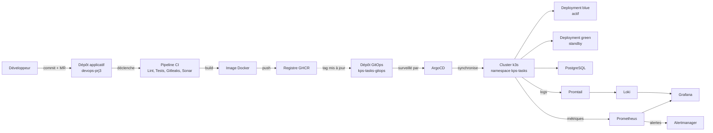

# Architecture finale — LogiCare Solutions / KPS Tasks API

*Note sur le format : le brief recommande un fichier `final-architecture.png` séparé. Ce dépôt utilise à la place un diagramme Mermaid intégré directement dans ce document (rendu nativement sur GitHub) — plus simple à maintenir qu'une image statique, et tout aussi lisible pendant la soutenance.*

## Vue d'ensemble

## Les deux VPS

| VPS | Contenu |
|---|---|
| **VPS 1** | k3s, l'application (blue/green), PostgreSQL, ArgoCD, Prometheus, Grafana, Alertmanager, Loki, Promtail |
| **VPS 2 / plateforme Git** | Pipeline CI/CD, registre Docker, dépôt applicatif, dépôt GitOps |

## Trajet d'un changement applicatif (le flux le plus important à savoir expliquer)

1. Développeur commit sur une branche du dépôt applicatif, ouvre une Merge Request
2. Pipeline CI : lint → tests → Gitleaks → SonarCloud → build de l'image Docker → push vers le registre
3. Le tag de la nouvelle image est mis à jour dans le dépôt GitOps (commit distinct, volontairement séparé du dépôt applicatif)
4. ArgoCD détecte le changement (polling ou webhook) et synchronise automatiquement le cluster
5. Le nouveau pod est créé sur k3s, ses probes sont vérifiées avant qu'il ne reçoive du trafic (blue/green)
6. Prometheus scrape ses métriques, Promtail collecte ses logs, tout est visible dans Grafana
7. Si une alerte se déclenche, Alertmanager la reçoit

## Pourquoi cette séparation en deux dépôts (applicatif / GitOps)

Le dépôt applicatif répond à "comment le code est construit". Le dépôt GitOps répond à "quoi tourne actuellement sur le cluster". Les séparer permet à ArgoCD de surveiller uniquement ce second dépôt (l'état désiré du cluster) sans jamais avoir besoin d'accès au code source ni de se déclencher sur chaque commit applicatif (ex : un simple changement de test ne doit pas déclencher un déploiement).
